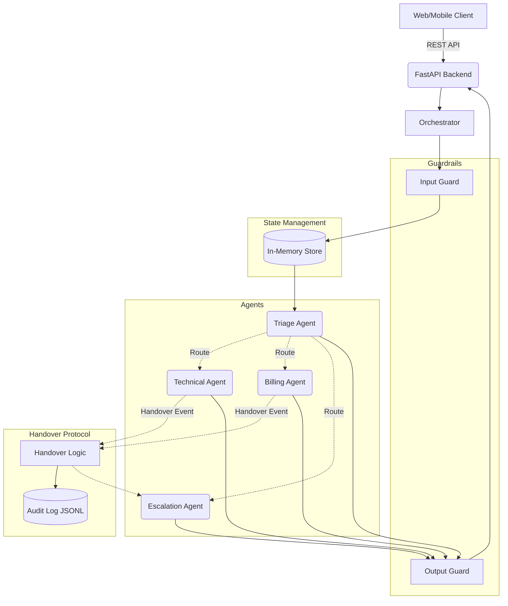
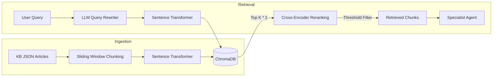

# Architecture Documentation

## 1. Component Interaction Diagram

## 2. Handover Protocol Sequence Diagram

## 3. RAG Pipeline Diagram

## 4. Data Flow for Test Scenarios

- **Scenario 1 (Technical routing):**
  - Input: Alert integration failing.
  - Triage extracts entities (Plan: Pro, Issue: integration). Routes to Technical.
  - Technical retrieves KB-005 and KB-007, grounds response, citations appended.
  
- **Scenario 2 (Technical to Billing):**
  - Input: Upgrade to Enterprise, check SSO issue.
  - Triage routes to Technical.
  - Technical processes SSO (KB-009). Detects "upgrade" (billing intent) and flags `suggested_next_agent = "billing"`.
  - Orchestrator catches flag, executes handover to Billing. Billing answers plan upgrade.

- **Scenario 3 (Auto-escalation):**
  - Input: Charged twice, immediate refund, manager.
  - Triage routes to Billing.
  - Billing detects "manager" keyword and refund request over safe thresholds.
  - Billing returns `requires_handover = True` (target: Escalation).
  - Escalation builds Operator payload.

- **Scenario 4 (KB Gap / Hallucination prevention):**
  - Input: Datadog integration.
  - Triage routes to Technical.
  - Technical retrieves KB chunks but finds no mention of Datadog.
  - Output Guard checks the response against the KB. Technical agent informs user it's unsupported and escalates.

## 5. Production Evolution Plan

To migrate this prototype to a fully scalable production environment:
1. **Multi-tenancy and Auth**: Implement OAuth2/OIDC. Embed `tenant_id` into all ChromaDB metadata. 
2. **State Persistence**: Replace the Python in-memory `state_store` dictionary with Redis.
3. **Queueing**: For high throughput, decouple the Orchestrator from the REST API using Celery or Kafka so long-running LLM inferences don't block web workers.
4. **Vector Database**: Upgrade ChromaDB to a managed cluster (e.g. Pinecone, Milvus) for horizontal scalability.
5. **Rate Limiting**: Enforce token-bucket rate limits per user API endpoint using Redis.

## 6. Live Deployment

The system is currently deployed and operational at the following endpoints:

- **Frontend Application (Streamlit)**: [https://clouddash-supportvikarasoumyadeep.streamlit.app/](https://clouddash-supportvikarasoumyadeep.streamlit.app/)
  - Hosts the user interface and communicates with the backend via REST.
- **Backend API (FastAPI)**: [https://clouddash-backend.onrender.com/](https://clouddash-backend.onrender.com/)
  - **Health Check**: [https://clouddash-backend.onrender.com/health](https://clouddash-backend.onrender.com/health)
  - Handles multi-agent logic, RAG retrieval, and state management on Render infrastructure.
