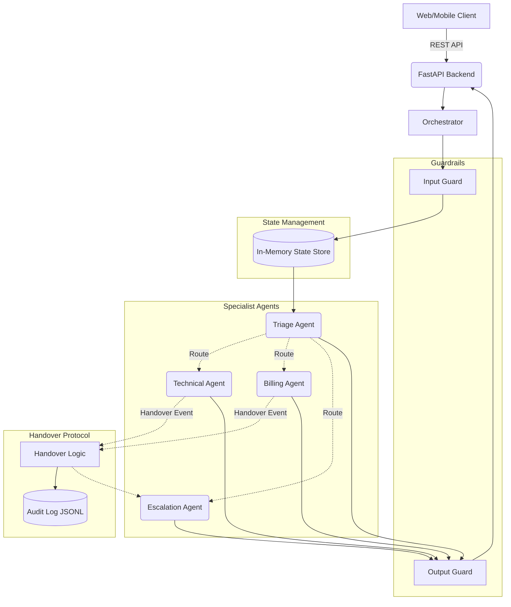
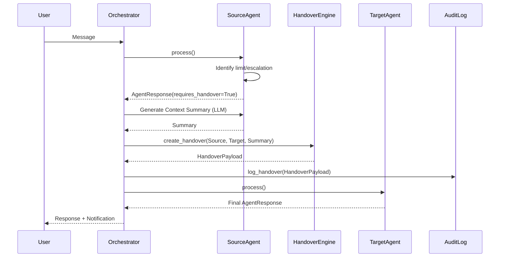
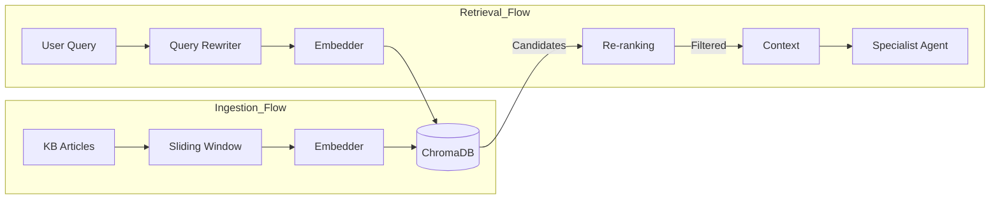

# 🏛️ CloudDash System Architecture

This document provides a comprehensive technical overview of the CloudDash multi-agent support system, detailing the orchestration logic, data flow, and RAG integration.

---

## 1. High-Level System Design

The architecture is built on a **Modular Multi-Agent** pattern, where a central Orchestrator manages conversation state, security guardrails, and agent transitions.

---

## 2. Conversation & Handover Protocol

CloudDash utilizes a formal handover protocol to ensure context is preserved when a user is moved between specialists.

### Handover Sequence

---

## 3. RAG Pipeline & Knowledge Ingestion

Our Retrieval-Augmented Generation pipeline ensures that agents provide grounded responses based on verified technical documentation.

| Phase | Description |
| :--- | :--- |
| **Ingestion** | Sliding-window chunking of JSON articles -> `all-MiniLM-L6-v2` embeddings -> ChromaDB. |
| **Retrieval** | LLM-based query rewriting -> Semantic search -> Cross-encoder re-ranking. |
| **Augmentation** | Top-K chunks are injected into the agent's system prompt as a "Grounding Context". |

---

## 4. Operational Guardrails

| Guardrail | Function | Implementation |
| :--- | :--- | :--- |
| **Input Guard** | Detects PII, injection attempts, and off-topic requests. | Regex + LLM Classifier |
| **Output Guard** | Ensures responses are professional, grounded, and free of sensitive internal data. | LLM Fact-Checker |
| **State Consistency** | Prevents agent loops and ensures a deterministic conversation path. | Finite State Machine |

---

## 5. Live Deployment Status

The system is currently operational in a distributed production environment:

- **Frontend Application**: [Streamlit Portal](https://clouddash-supportvikarasoumyadeep.streamlit.app/)
- **API Infrastructure**: [Render Backend Service](https://clouddash-backend.onrender.com/)
- **Monitoring**: [Health Endpoint](https://clouddash-backend.onrender.com/health)

---

## 6. Production Evolution Roadmap

To transition this architecture to a high-availability enterprise environment, the following migrations are planned:

1. **State Management**: Migration from local `state_store` to **Redis Cluster**.
2. **Authentication**: Integration of **Auth0/Okta** for multi-tenant isolation.
3. **Async Processing**: Decoupling the Orchestrator via **Celery/Redis** to handle long-running LLM tasks.
4. **Vector Scaling**: Transitioning ChromaDB to **managed Pinecone** for horizontal scalability.
