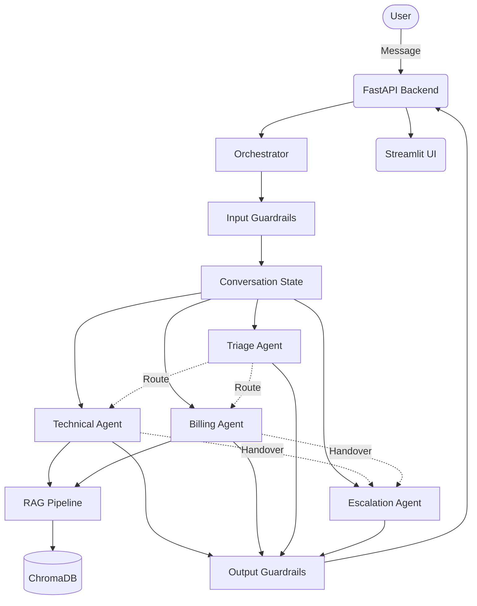

# ☁️ CloudDash — Enterprise AI Support System

[](https://www.python.org/)
[](https://fastapi.tiangolo.com/)
[](https://streamlit.io/)
[](https://ai.google.dev/)
[](https://www.trychroma.com/)

CloudDash is a production-grade, multi-agent customer support platform designed for high-scale SaaS environments. It leverages an advanced **Orchestrator-Agent** architecture to provide grounded, secure, and intelligent support through RAG (Retrieval-Augmented Generation) and deterministic state management.

---

## 🚀 Live Deployment

The platform is fully operational and can be accessed via the following endpoints:

| Component | URL | Status |
| :--- | :--- | :--- |
| **Frontend UI** | [CloudDash Support Portal](https://clouddash-supportvikarasoumyadeep.streamlit.app/) | `Live` |
| **Backend API** | [API Gateway / Health](https://clouddash-backend.onrender.com/health) | `Active` |

---

## ✨ Key Features

- **Multi-Agent Orchestration**: Intelligent routing between specialized agents (Triage, Technical, Billing, Escalation).
- **Advanced RAG Pipeline**: Semantic search using `sentence-transformers` and ChromaDB with cross-encoder re-ranking for maximum accuracy.
- **Enterprise Guardrails**: Built-in input/output validation, PII redaction, and off-topic filtering.
- **Deterministic Handover**: Structured protocol for agent-to-agent and agent-to-human transitions with full audit logging.
- **Hybrid LLM Strategy**: Native support for Google Gemini with automated fallback to local Ollama instances.

---

## 🏗️ System Architecture

CloudDash employs a centralized Orchestrator pattern to ensure safety and consistency across all interactions.



---

## 🛠️ Getting Started

### Prerequisites
- Python 3.10+
- Google Gemini API Key

### Installation

1. **Clone & Setup Environment**
   ```bash
   git clone https://github.com/your-repo/clouddash-support.git
   cd clouddash-support
   python -m venv venv
   source venv/bin/activate
   pip install -r requirements.txt
   ```

2. **Configuration**
   Copy the environment template and configure your keys:
   ```bash
   cp .env.example .env
   # Set your GEMINI_API_KEY in .env
   ```

3. **Initialize Knowledge Base**
   Process and ingest the technical documentation into the vector store:
   ```bash
   python knowledge_base/ingest.py
   ```

4. **Launch Services**
   ```bash
   # Terminal 1: Backend
   ./start.sh

   # Terminal 2: Frontend
   streamlit run ui/app.py
   ```

---

## 🧪 Testing & Evaluation

We evaluate the system against four critical support scenarios. Run the full suite using:
```bash
pytest tests/ -v
```

### Manual Verification Examples

| Scenario | Input Example | Expected Behavior |
| :--- | :--- | :--- |
| **Technical** | "AWS credentials update failing on Pro plan" | Routes to Tech Agent -> KB Retrieval -> Source Citation |
| **Multi-Intent** | "Upgrade to Enterprise and check SSO bug" | Tech resolution -> Handover -> Billing resolution |
| **Escalation** | "Double charge, need refund and manager" | Billing identification -> Auto-escalation to human agent |
| **KB Gap** | "Question about Datadog integration" | Hallucination prevention -> Honest acknowledgement |

---

## 📈 Design Decisions & Roadmap

### Core Decisions
- **Vector Storage**: ChromaDB for seamless local development and high-performance retrieval.
- **Orchestration**: Centralized control to mitigate LLM loops and ensure guardrail compliance.
- **Observability**: Structured JSONL audit logs for every handover and escalation event.

### Future Roadmap
- [ ] **State Persistence**: Migration from in-memory state to Redis.
- [ ] **Streaming**: Implementation of Server-Sent Events (SSE) for real-time response streaming.
- [ ] **Horizontal Scaling**: Transitioning to a managed vector store (Pinecone/Milvus).
