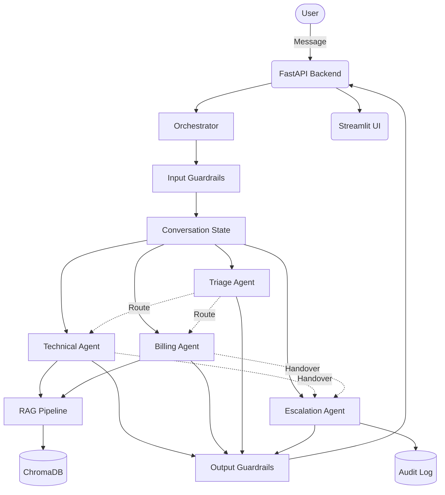

# CloudDash — Support System

A production-grade multi-agent customer support platform.

## 🚀 Live Deployment

- **Frontend UI**: [https://clouddash-supportvikarasoumyadeep.streamlit.app/](https://clouddash-supportvikarasoumyadeep.streamlit.app/)
- **Backend API**: [https://clouddash-backend.onrender.com/health](https://clouddash-backend.onrender.com/health)

### Deployment Details

#### Backend (FastAPI)
The backend is deployed on **Render** using the provided `render.yaml`. It handles the multi-agent orchestration, RAG retrieval, and conversation state.

#### Frontend (Streamlit)
The frontend is deployed on **Streamlit Community Cloud**, configured to communicate with the Render backend via:
```toml
BACKEND_URL = "https://clouddash-backend.onrender.com"
```

A production-quality prototype of a multi-agent customer support system for a fictional SaaS product called **CloudDash**. It utilizes Google Gemini (with an Ollama fallback) to drive conversational workflows, extracting entities, classifying intent, and querying a RAG pipeline backed by a VectorStore (ChromaDB) for high-quality, grounded responses.

The multi-agent design breaks the system into distinct personas: a **Triage Agent** for intent classification, a **Technical Agent** for API/infrastructure issues, a **Billing Agent** for account/cost issues, and an **Escalation Agent** for seamless handover packaging to a human operator. The state management engine automatically protects downstream agents via strict input and output guardrails (e.g., PII redaction and off-topic filtering).

## Architecture Diagram



## Setup Instructions

1. **Clone the repository** and navigate to the project directory:
   ```bash
   cd clouddash-support
   ```

2. **Create venv + install requirements**:
   ```bash
   python -m venv venv
   source venv/bin/activate
   pip install -r requirements.txt
   ```

3. **Configure Environment variables**:
   Copy `.env.example` to `.env` and fill in your API key.
   ```bash
   cp .env.example .env
   # Edit .env and set GEMINI_API_KEY
   ```

4. **Ingest the Knowledge Base**:
   This step parses the 20 KB articles, creates sliding-window chunks, and stores them in ChromaDB.
   ```bash
   python knowledge_base/ingest.py
   ```

5. **Run the API**:
   Start the FastAPI backend:
   ```bash
   ./start.sh
   ```

6. **(Optional) Run Streamlit UI**:
   Start the Streamlit UI in another terminal:
   ```bash
   streamlit run ui/app.py
   ```

## Testing the 4 Evaluation Scenarios

Each scenario should be run in its own conversation. Use the commands below to test end-to-end behavior.

### Step 1: Create a conversation

```bash
# Create a new conversation and capture the ID
CONV_ID=$(curl -s -X POST http://localhost:8000/conversations | python3 -c "import sys,json; print(json.load(sys.stdin)['conversation_id'])")
echo "Conversation ID: $CONV_ID"
```

### Scenario 1 — Single Agent Technical Resolution

**Input:** Alert failure after AWS credential update (Pro plan).  
**Expected:** Routes to Technical Agent, retrieves KB articles, cites sources, provides step-by-step resolution.

```bash
curl -s -X POST http://localhost:8000/conversations/$CONV_ID/messages \
  -H "Content-Type: application/json" \
  -d '{"message": "My CloudDash alerts stopped firing after I updated my AWS integration credentials yesterday. I am on the Pro plan."}' | python3 -m json.tool
```

### Scenario 2 — Cross-Agent Handover

**Input:** SSO issue + plan upgrade request (two intents).  
**Expected:** Routes to Technical first (SSO), then hands over to Billing (upgrade). Handover logged.

```bash
CONV_ID2=$(curl -s -X POST http://localhost:8000/conversations | python3 -c "import sys,json; print(json.load(sys.stdin)['conversation_id'])")

curl -s -X POST http://localhost:8000/conversations/$CONV_ID2/messages \
  -H "Content-Type: application/json" \
  -d '{"message": "I want to upgrade from Pro to Enterprise, but first can you check if the SSO integration issue I reported last week has been resolved?"}' | python3 -m json.tool

# Verify handover was logged
cat logs/handover_audit.jsonl | python3 -m json.tool
```

### Scenario 3 — Escalation to Human

**Input:** Duplicate charge, refund demand, wants manager.  
**Expected:** Routes to Billing, auto-escalates to Escalation Agent. `escalated: true` in state.

```bash
CONV_ID3=$(curl -s -X POST http://localhost:8000/conversations | python3 -c "import sys,json; print(json.load(sys.stdin)['conversation_id'])")

curl -s -X POST http://localhost:8000/conversations/$CONV_ID3/messages \
  -H "Content-Type: application/json" \
  -d '{"message": "I have been charged twice for April. I need an immediate refund and I want to speak to a manager."}' | python3 -m json.tool

# Verify escalation state
curl -s http://localhost:8000/conversations/$CONV_ID3 | python3 -c "import sys,json; d=json.load(sys.stdin); print(f'Escalated: {d[\"escalated\"]}, Agent: {d[\"current_agent\"]}')"
```

### Scenario 4 — KB Retrieval Failure / Honest Acknowledgment

**Input:** Datadog integration question (not in KB).  
**Expected:** Does NOT fabricate an answer. Acknowledges KB gap. Offers to escalate.

```bash
CONV_ID4=$(curl -s -X POST http://localhost:8000/conversations | python3 -c "import sys,json; print(json.load(sys.stdin)['conversation_id'])")

curl -s -X POST http://localhost:8000/conversations/$CONV_ID4/messages \
  -H "Content-Type: application/json" \
  -d '{"message": "Does CloudDash support integration with Datadog for cross-platform alerting?"}' | python3 -m json.tool
```

### Run All Tests

```bash
pytest tests/ -v
```

### Health Check

```bash
curl -s http://localhost:8000/health | python3 -m json.tool
```

## Design Decisions

- **ChromaDB**: Chosen as the vector store because it offers seamless in-memory persistence and local storage out of the box without requiring external database setups, making it ideal for a localized prototype.
- **Sentence-Transformers**: Opted for local dense embeddings (`all-MiniLM-L6-v2`) via `sentence-transformers` for zero-cost, private, and highly accurate semantic retrieval. Also implemented a cross-encoder component for optional relevance reranking.
- **Orchestrator Pattern**: A centralized orchestrator handles the State and manages inputs/outputs rather than allowing agents to call each other recursively. This mitigates runaway loops and forces everything through deterministic PII/injection guardrails.
- **Handover Logic**: Implemented using a discrete handover protocol where LLMs output structured metadata. Handover packets are validated via Pydantic and aggressively logged to standard JSONL output buffers for auditing.

## Known Limitations and Trade-offs

- **In-memory State Store**: Conversation state currently resides in a Python dictionary. For production, this should immediately be ported to Redis or a traditional database for cross-worker persistence.
- **Simple Chunking Strategy**: The current RAG implementation uses a very naive word-based chunking method. Deployments should switch to advanced recursive character splitters or tokenizers to prevent context splitting inside code blocks.

## How to add a new Agent

Adding a new agent requires strictly zero modifications to the core Orchestrator code!
1. Add a configuration block under the `agents` key in `config/agents.yaml` describing the agent, prompt, and routing properties.
2. Create `<name>_agent.py` in the `agents/` directory defining the processing logic. Make sure the class explicitly inherits from `BaseAgent` and handles returning an `AgentResponse`.
